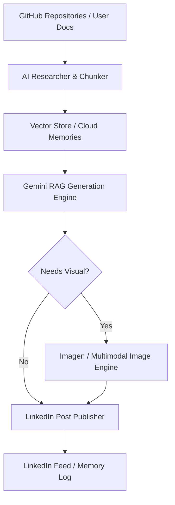

# 🚀 REXION LinkedIn RAG & Autonomous Research Agent

An intelligent, autonomous personal branding agent that researches your real code repositories, retrieves authentic context from your technical documents/resumes via vector RAG, generates insightful developer posts with Google Gemini, and automatically publishes to LinkedIn.

---

## ✨ Features

- **🔍 Autonomous GitHub Research**: Automatically scans your GitHub projects, chooses unposted repositories, and ideates authentic technical lessons and architecture deep-dives.
- **📚 Multi-Format RAG Ingestion**: Ingests `.pdf`, `.md`, `.txt`, and `.docx` documents into vector memory with cosine similarity search.
- **🧠 Google Gemini Engine**: Cascading fallback across high-speed Gemini models (`gemini-2.5-flash`, `gemini-3.5-flash`, `gemini-3.6-flash`, etc.) to guarantee 100% uptime with zero 503 errors.
- **🎨 AI Graphic Generation**: Optionally generates supporting diagrams and concept graphics using Imagen 3 / Gemini Multimodal and uploads directly to LinkedIn.
- **⚡ Dual Storage Mode**: Works seamlessly out of the box with zero setup using local JSON vector stores, or connects to MongoDB Atlas for persistent cloud memory.
- **🛡️ Self-Service**: Anyone can clone, configure their own `.env`, and run it in seconds.

---

## 🛠️ Quick Setup (For Anyone)

### 1. Configure Environment Variables
Copy `.env.example` to `.env`:
```bash
cp scripts/linkedin-rag-agent/.env.example scripts/linkedin-rag-agent/.env
```

Fill in your API keys in `.env`:
```env
# Google AI Studio (Free): https://aistudio.google.com/
GEMINI_API_KEY=your_gemini_api_key_here

# LinkedIn OAuth token with w_member_social scope
LINKEDIN_ACCESS_TOKEN=your_linkedin_access_token

# Your details
AUTHOR_NAME=Your Name
GITHUB_USERNAME=your_github_username
```

---

## 🏃 Usage Commands

### 1. Check Status & Diagnostic
```bash
node scripts/linkedin-rag-agent/index.js --status
```

### 2. Autonomous Mode (Dry Run Preview)
Researches your GitHub repositories, ideates a technical angle, and formats a post without publishing:
```bash
node scripts/linkedin-rag-agent/index.js --auto --dry-run
```

### 3. Autonomous Publish to LinkedIn
```bash
node scripts/linkedin-rag-agent/index.js --auto
```

### 4. Custom Topic Post
```bash
node scripts/linkedin-rag-agent/index.js --topic "Lessons optimizing database indexing in PostgreSQL"
```

### 5. Ingest Your Own Resume / Technical Notes
Place any `.pdf`, `.md`, `.txt`, or `.docx` files in `scripts/linkedin-rag-agent/documents/` and run:
```bash
node scripts/linkedin-rag-agent/index.js --ingest
```

---

## 📦 Running via Rexion Root Scripts

From the root project folder:
```bash
# Preview autonomous post
npm run agent:linkedin:dry-run

# Run autonomous agent and publish
npm run agent:linkedin:auto

# Ingest documents into vector memory
npm run agent:linkedin:ingest
```

---

## 🏗️ Architecture


