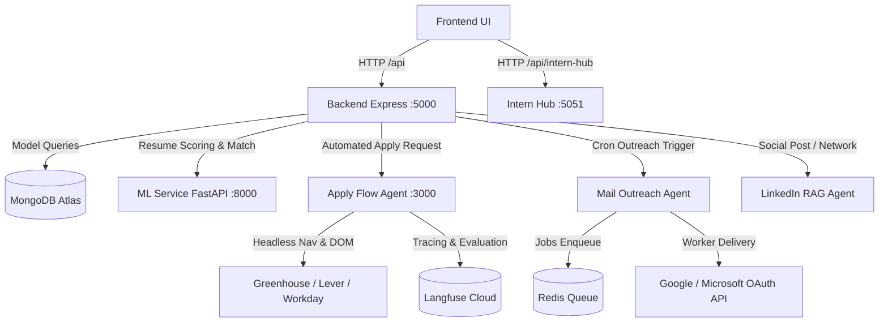

# brain.md — REXION AI System Architecture & Source of Truth

> **System Overview**: REXION AI is an autonomous, agentic career operating system and intelligence engine designed for end-to-end job discovery, ATS resume parsing and scoring, targeted cold email outreach sequences, LinkedIn network automation, and autonomous multi-platform job applications with proof verification.

---

## 1. Project Purpose

REXION AI eliminates friction in technical career progression and job acquisition by combining:
- **Autonomous Job Discovery**: Continuous multi-source ingestion of live job postings (within a strict 48-hour freshness window) across Greenhouse, Lever, Ashby, Adzuna, and LinkedIn.
- **ATS Scoring & Career Classification**: Multi-modal ML pipeline (TF-IDF vectorization, scikit-learn models, and optional transformer/BERT models) that computes match scores, missing skills, and career trajectory projections.
- **Agentic 1-Click Application Automation**: Supervised 16-state browser automation engine (Puppeteer / Playwright) that navigates job postings, analyzes ATS form structures, executes grounded screening answers via RAG, uploads tailored resumes, and captures screenshot proofs.
- **Cold Email Outreach & Networking Engine**: Automated personalized outreach generation (using LLMs via Gemini / OpenRouter), deliverability tracking via SMTP/Snov/OAuth (Gmail/Outlook), bounce/reply detection, and LinkedIn automated engagement.
- **Intern Hub**: Micro-internship and gig discovery system connecting students and early-career developers with hands-on projects.

---

## 2. High-Level Architecture

REXION AI follows a distributed microservices and multi-agent architecture orchestrated by a unified dev-runner and PM2 in production.

```
                      +---------------------------------------+
                      |   Frontend (React + Vite + Zustand)   |
                      |          Port: 5173 / SPA             |
                      +-------------------+-------------------+
                                          |
                                          | HTTP / REST (JWT & Session)
                                          v
                      +---------------------------------------+
                      |   Primary Backend (Node.js / Express) |
                      |               Port: 5000              |
                      +-------+-------------------+-------+---+
                              |                   |       |
            +-----------------+                   |       +-----------------+
            |                                     |                         |
            v                                     v                         v
+-----------------------+             +-----------------------+   +-------------------+
|  ML / ATS Service     |             |  Intern Hub Backend   |   | MongoDB Atlas /   |
|  (Python / FastAPI)   |             |  (Node.js / Express)  |   | In-Memory Fallback|
|  Port: 8000           |             |  Port: 5051           |   +-------------------+
+-----------------------+             +-----------------------+
            ^                                     |
            |                                     v
            |                         +-----------------------+
            |                         |  Adzuna / Aggregators |
            |                         +-----------------------+
            |
+-----------+-------------------------------------------------------------+
| Autonomous Specialized Agent Workers                                    |
| - apply-flow-agent (Port 3000): Headless browser autofill & proof capture|
| - job-agentic-ai: Live job scraper & crawler                            |
| - linkedin-rag-agent: Vector store & autonomous network researcher      |
| - mail-outreach-agent: TypeScript BullMQ worker & OAuth sender          |
+-------------------------------------------------------------------------+
```

---

## 3. Folder Responsibilities

| Path | Primary Role |
| :--- | :--- |
| `frontend/` | React 18 SPA built with Vite, React Router v6, Zustand (`resumeStore`), Context API (`AuthContext`), Vanilla CSS Modules, and Framer Motion. |
| `backend/` | Main REST API server (Express 5/Node.js ESM) hosting core business logic: auth, profile, application orchestrator, ATS parsing, domination engine, and integrations. |
| `backend/intern-hub/` | Standalone sub-service handling micro-internship listings, Adzuna fetching, and gig workflows (runs on port 5051). |
| `ml_service/` | FastAPI Python service (port 8000) providing TF-IDF vectorization, scikit-learn models, BERT resume categorization, ATS scoring, and JSearch/Adzuna querying. |
| `agents/apply-flow-agent/` | Headless browser autofill microservice (port 3000) utilizing Puppeteer, Groq LLM, and Langfuse tracing to complete applications on Greenhouse, Lever, and Workday. |
| `agents/job-agentic-ai/` | Autonomous scraper discovering ATS job postings directly from board URLs with proof capture. |
| `agents/linkedin-rag-agent/` | Local vector-store (Vectra/JSON) and Gemini-powered research agent for generating and scheduling LinkedIn posts and network outreach. |
| `agents/mail-outreach-agent/` | Production cold email worker built with TypeScript, Prisma, BullMQ, Redis, and Gmail/Outlook OAuth integrations. |
| `scripts/` | Local process orchestration (`dev-runner.local.cjs`, `dev-runner.cjs`), PM2 ecosystem definitions, and automation runners. |
| `uploads/` | Local file storage for candidate resumes, generated email previews, and application screenshot evidence. |

---

## 4. Technology Stack

### Frontend
- **Framework**: React 18.2.0, Vite 5.4.x
- **Routing**: `react-router-dom` v6.8.0 with route-level lazy loading
- **State Management**: Zustand v5 (`resumeStore.js`), React Context (`AuthContext.jsx`, `AppContext.jsx`)
- **Styling**: Vanilla CSS Modules, custom CSS custom properties, Lucide React icons, Framer Motion v12
- **Auth & Third-Party**: `@react-oauth/google` v0.13.4, Axios v1.3.0 with automatic request/response interceptors

### Core Backend
- **Runtime & Framework**: Node.js (ES Modules, `type: module`), Express 5.2.1
- **Database & ODM**: MongoDB Atlas via Mongoose 9.2.1 (with in-memory Map fallbacks for high-availability offline runs)
- **Security & Networking**: Helmet 8.1.0, CORS, `express-rate-limit` 8.2.1, `express-session`, `connect-pg-simple`
- **File & Document Processing**: `multer`, `pdf-parse`, `mammoth` (DOCX parsing)
- **Task Scheduling & Queues**: `node-cron`, `bullmq` 6.3.7, `ioredis` 6.0.0
- **Observability**: `@langfuse/openai`, `@langfuse/otel`, `@opentelemetry/sdk-node`, Winston 3.19.0

### Machine Learning Service (`ml_service`)
- **Runtime & Framework**: Python 3.10+ / 3.11, FastAPI 0.104.1, Uvicorn
- **ML & Data Stack**: `scikit-learn` 1.3.2, `joblib`, `numpy`, `pandas`, `pdfplumber`, `pypdf2`, `python-docx`
- **Inference Engines**: Pretrained TF-IDF vectorizer + LogisticRegression / RandomForest / MLP; optional HuggingFace Transformers (BERT)

### Microservice Agents
- **Languages**: Node.js (ESM), TypeScript (`mail-outreach-agent`), Python
- **Automation Drivers**: Puppeteer 22.x - 25.x
- **LLM SDKs**: Groq SDK (`groq-sdk`), OpenRouter SDK (`@openrouter/sdk`), OpenAI (`openai`), Google Gemini API (`@google/genai` / HTTP)

---

## 5. Dependency Graph



---

## 6. Execution Flow

### 1. Dev Runner (`npm run dev`)
- Invoked via `node scripts/dev-runner.local.cjs`.
- Detects the Python virtual environment (`.venv`, `.venv-1`, or host Python) verifying `ml_service.app.main`.
- Concurrently spins up:
  1. `ml_service` on `127.0.0.1:8000`
  2. `backend` on `127.0.0.1:5000` (runs `npm run dev` or `npm run dev:mongo` based on flags)
  3. `intern_hub_backend` on `127.0.0.1:5051`
  4. `frontend` on `127.0.0.1:5173`
- Polls health check URLs for each child process and handles unified SIGINT/SIGTERM teardown.

### 2. Production Runner (`ecosystem.config.cjs`)
- Managed by PM2:
  - `rexion-backend`: `server.js` (cwd: `./backend`, instances: 1, memory limit: 1G)
  - `apply-flow-agent`: `server.js` (cwd: `./agents/apply-flow-agent`, instances: 1, memory limit: 500M)

---

## 7. Request Lifecycle

1. **Request Ingress**:
   - Hits Express app; passes through `helmet()`, strict `cors()` origin validation (rejecting non-whitelisted browser origins in production), and request body parsers.
2. **Rate Limiting**:
   - Global limiter: 500 requests per 15 minutes per IP (skips localhost loopback).
   - Auth limiter: 30 requests per 15 minutes per IP on `/api/auth` and `/connect`.
3. **Session & Authentication**:
   - `authMiddleware.protect`: Inspects `Authorization: Bearer <JWT>`, verifies cryptographic signature, attaches active `User` document to `req.user`.
   - `authMiddleware.optionalProtect`: Verifies token if present without aborting unauthenticated guests (enabling demo/preview usage).
4. **Controller & Service Layer**:
   - Validates input schemas (`joi` / custom guards).
   - Coordinates database models, microservice clients (`mlServiceClient`, `formFillerService`), and caching layers.
5. **Response & Error Handling**:
   - Success responses delivered with standard envelope: `{ success: true, data: ... }` or `{ message: ... }`.
   - Exceptions routed to `errorHandler`: maps `AppError` operational codes or returns formatted 500 with stack traces masked in production.

---

## 8. Database Design

Primary persistent storage: **MongoDB** (via Mongoose).
Secondary / Agent storage: **PostgreSQL** (`connect-pg-simple` / Prisma for `mail-outreach-agent`), **SQLite** (`ml_service` local predictions cache), **Vectra** (local JSON vector embeddings).

### Core Mongoose Collections (`backend/src/models/`)

#### 1. `User` (`User.js`)
- `name` (String, required)
- `email` (String, unique, lowercase, indexed)
- `password` (String, bcrypt hashed, `select: false`)
- `role` (Enum: `'user'`, `'admin'`)
- `plan` (Enum: `'free'`, `'pro'`, `'elite'`)
- `authProviders`: `{ google: { sub, email, picture } }`
- `profile`: Mixed object storing personal settings

#### 2. `CandidateProfile` (`CandidateProfile.js`)
- `userId` (String / ObjectId, indexed)
- `contactInfo`: `{ fullName, email, phone, city, state, country, zipCode, linkedinUrl, githubUrl, portfolioUrl }`
- `primaryDomain`, `secondaryDomains`: String arrays
- `skills`: `[String]`, `yearsOfExperience`: Number
- `education`: `[{ degree, field, institution, graduationYear }]`
- `resumeChunks`: `[{ chunkId, text, section, embedding }]` (vector ground for RAG)
- `screeningAnswers`: Key-value cache for repetitive job form questions

#### 3. `Application` (`Application.js`)
- `user`: ObjectId or String ID
- `batchId`: String (references `ApplicationBatch`)
- `jobId`, `externalJobId`, `canonicalJobIdentity`: Indexed hash to prevent duplicate submissions
- `platform`: Enum (`'greenhouse'`, `'lever'`, `'ashby'`, `'workday'`, `'playwright'`, `'custom'`, `'manual'`)
- `status`: Enum (mapped to `APPLICATION_STATES`)
- `matchScore`: Number, `matchExplanation`: `{ matchedSkills, missingSkills, reasons }`
- `generatedAnswers`: `[{ question, answer, confidence, evidenceChunkIds, source }]`
- `evidenceScreenshot`: Relative file path to captured PNG/WebP proof
- `auditEvents`: `[{ eventType, message, timestamp, metadata }]`

#### 4. `ApplicationBatch` (`ApplicationBatch.js`)
- `batchId` (Number/String, unique)
- `userId`
- `status`: Enum (`'pending'`, `'processing'`, `'completed'`, `'failed'`)
- `emailPreview`: Path to generated outreach report

#### 5. `Internship` (`Internship.js`)
- `title`, `company`, `location`, `description`
- `category`: Enum (`'engineering'`, `'data'`, `'design'`, `'product'`, `'marketing'`, `'other'`)
- `stipend`: `{ amount, currency, frequency }`
- `status`: Enum (`'draft'`, `'published'`, `'closed'`, `'archived'`)
- `source`: Direct listing or external aggregation (Adzuna)

#### 6. Auxiliary Models
- `Campaign`, `CampaignSend`: Sequence and dispatch state for cold email outreach.
- `OutreachMailbox`: User-connected SMTP/IMAP credentials with daily dispatch limits.
- `SuppressionEntry`: Unsubscribed / bounced email addresses to prevent compliance violations.
- `Resume`: Raw uploaded resume binary metadata and extraction status.

---

## 9. API Contracts

### Authentication (`/api/auth`)
- `POST /api/auth/register`: `{ fullName, email, password }` -> `{ message, token, user }`
- `POST /api/auth/login`: `{ email, password }` -> `{ message, token, user }`
- `POST /api/auth/google`: `{ credential }` (Google ID token) -> `{ message, token, user }`

### Applications & 1-Click Engine (`/api/applications`)
- `POST /api/applications/resume/upload`: Multi-part `resume` file or `rawText` -> Parsed profile, domain, and chunk counts
- `GET /api/applications/profile`: Returns active `CandidateProfile`
- `PUT /api/applications/profile`: Updates candidate contact info, preferences, and domains
- `POST /api/applications/discover`: `{ query, location, domain, limit }` -> Returns jobs filtered to $\le 48$ hours old with explainable match breakdown
- `POST /api/applications/apply-one-click`: `{ job, options }` -> Initializes 16-state orchestrator, navigates, answers questions, captures proof
- `GET /api/applications/status/:id`: Returns application state, audit timeline, and screenshot evidence URI
- `GET /api/applications/metrics`: Returns pipeline analytics (submissions, success rates, channel distribution)

### ML & ATS (`/api/ml` & `http://localhost:8000`)
- `GET /health`: `{ status: 'ok', service: 'rexion_ml_ats', active_career_backend: 'production' | 'bert' }`
- `POST /predict`: Uploads resume (`file`), optional `job_description`, `location`, `remote` -> Returns predicted career path, confidence score, ATS match score, extracted skills, and missing skills

### Intern Hub (`/api/internships` & `http://localhost:5051/api/internships`)
- `GET /api/internships`: Query params: `category`, `search`, `location`, `remote`, `page`, `limit` -> Paginated internship listings
- `GET /api/internships/:id`: Full details of specific internship
- `POST /api/internships/:id/apply`: Submit student application

### Domination & Cold Outreach (`/api/domination` & `/api/outreach`)
- `POST /api/domination/run`: Ingests resume, searches high-probability hiring managers, drafts outreach, queues email delivery
- `GET /api/outreach/mailboxes`: Connected email sender accounts with health status
- `POST /api/outreach/send-test`: Diagnostic email verification

---

## 10. Key Algorithms & Business Logic

### 1. 16-State Supervised Application Machine
The application orchestrator (`applicationOrchestrator.js`) enforces a deterministic state machine:
```
DISCOVERED -> QUEUED -> PRE_APPLY_FRESHNESS_CHECK -> BROWSER_SPAWNED -> 
NAVIGATING -> FORM_DETECTED -> FORM_ANALYZED -> AUTOFILLING -> 
SCREENING_ANSWERED -> ATTACHMENTS_UPLOADED -> VALIDATION_READY -> 
READY_TO_SUBMIT -> SUBMITTING -> SUBMITTED (or FAILED / BLOCKED / NEEDS_USER_INPUT)
```
- **Concurrency Limiting**: Max 2 active browser application contexts per user simultaneously to prevent rate throttling and bot detection.
- **Pre-Apply Freshness Check**: Verifies posting age against `MAX_JOB_AGE_HOURS` (48 hours) immediately before browser launch.

### 2. Grounded Screening Q&A via RAG (`ragScreeningService.js`)
When an application encounters arbitrary screening questions (e.g., *"How many years have you used Kafka in production?"*):
1. **Safety Categorization**: Evaluates against `SAFE_FIELDS`, `VALIDATION_REQUIRED_FIELDS`, and `SENSITIVE_NEVER_GUESS`.
2. **Context Retrieval**: Runs cosine-similarity search over the user's `resumeChunks` (using Vectra embeddings or Gemini vector index).
3. **LLM Generation**: Instructs the model to generate factual answers grounded **strictly** in resume facts; falls back to `VALIDATION_READY` if confidence $< 0.85$ or if sensitive fields (sponsorship, disability) are unverified.

### 3. Explainable Job Match Scoring (`jobMatchingEngine.js`)
Weighted multi-factor score:
$$\text{Score} = (W_{\text{skills}} \times S_{\text{skills}}) + (W_{\text{title}} \times S_{\text{title}}) + (W_{\text{domain}} \times S_{\text{domain}}) + (W_{\text{exp}} \times S_{\text{exp}})$$
Returns an exact breakdown of:
- `matchedSkills`: Skills found in both profile and job posting
- `missingSkills`: High-frequency keywords present in posting but absent in profile
- `reasons`: Contextual rationale for score calculation

### 4. Job Canonical Hash & Freshness Filter (`jobFreshnessEngine.js`)
- Generates a canonical hash: `SHA256(company_normalized + title_normalized + location_normalized)` to deduplicate identical job postings syndicated across multiple job boards.
- Rejects postings with `ageHours > 48` or timestamps skewed into the future (> 5 min clock skew tolerance).

---

## 11. Configuration & Environment Variables

### Root & Backend (`backend/.env`, `backend/.env.local`)
| Variable | Required | Description | Default / Example |
| :--- | :--- | :--- | :--- |
| `PORT` | No | Backend HTTP listen port | `5000` |
| `NODE_ENV` | No | Execution environment | `development` |
| `MONGO_URI` / `DATABASE_URL` | Yes | MongoDB Atlas connection string | `mongodb+srv://...` |
| `JWT_SECRET` | Yes | Secret key for signing user auth tokens | Production string |
| `JWT_EXPIRE` | No | Expiration lifetime of user JWT | `30d` |
| `GOOGLE_CLIENT_ID` | No | Google OAuth 2.0 Web Client ID | Public client ID |
| `GEMINI_API_KEY` | Optional | Google Gemini API key for embeddings/posts | Text/embedding generation |
| `OPENAI_API_KEY` | Optional | OpenAI API key for Langfuse/fallback LLM | Standard key |
| `ML_SERVICE_URL` | No | URL to Python FastAPI service | `http://localhost:8000` |
| `LANGFUSE_PUBLIC_KEY` | Optional | Langfuse observability tracing key | `pk-lf-...` |
| `LANGFUSE_SECRET_KEY` | Optional | Langfuse observability secret | `sk-lf-...` |
| `LANGFUSE_BASE_URL` | Optional | Langfuse host URL | `https://cloud.langfuse.com` |

### Frontend (`frontend/.env`)
| Variable | Description | Default |
| :--- | :--- | :--- |
| `VITE_API_BASE_URL` | Base API prefix (proxied by Vite in development) | `/api` |
| `VITE_GOOGLE_CLIENT_ID` | Google OAuth Client ID for React Sign-In | Matches backend ID |

### ML Service (`ml_service/.env`)
| Variable | Description | Default |
| :--- | :--- | :--- |
| `CAREER_PREDICTION_BACKEND` | Inference model selection (`production`, `bert`, `auto`) | `auto` |
| `PORT` | Uvicorn listen port | `8000` |
| `JSEARCH_API_KEY` | RapidAPI JSearch API key for real-time job feeds | Optional |

---

## 12. Coding Standards & Naming Conventions

- **Module System**: Backend uses modern ES Modules (`import/export`, `"type": "module"` in `package.json`). Agents or scripts using CommonJS explicitly use `.cjs` extensions.
- **File Naming**:
  - React components: PascalCase (e.g., `WorkspaceSection.jsx`, `JobMatchingEngine.jsx`).
  - Controllers, services, models: camelCase (e.g., `authController.js`, `candidateProfileService.js`, `Application.js`).
  - CSS Modules: ComponentName.module.css (e.g., `Login.module.css`).
- **Code Style**: 2-space indentation, no semicolons preferred in frontend/backend JS, clean async/await patterns over raw promise chaining.
- **REST Endpoints**: Lowercase, kebab-case or slash hierarchy (e.g., `/api/applications/apply-one-click`, `/api/internships/:id/apply`).

---

## 13. Reusable Patterns

1. **Database Fallback Pattern (`backend/server.js`)**:
   - In-memory `Map` objects (`applicationBatches`, `applications`) mirror database state. If MongoDB connection handshakes fail or timeout during local offline development, APIs degrade gracefully instead of crashing.
2. **On-Demand DB Connection (`authController.js`)**:
   - If connection readyState is `0` or `3`, controllers execute an asynchronous retry wait loop (up to 8 seconds) allowing TLS and replica-set handshakes to complete before returning 503.
3. **Pluggable Source Providers (`jobProviderInterface.js`)**:
   - Standardized interface across all job feeds (`greenhouseProvider`, `leverProvider`, `adzunaProvider`, `linkedinProvider`) implementing `searchJobs({ query, location, domain, limit })`.
4. **Front-End Axios Interceptor Pattern (`apiClient.js`)**:
   - Automatically attaches `Bearer <token>` from localStorage/sessionStorage.
   - Clears stale credentials and redirects on 401 (excluding active authentication routes).
   - Automatically unsets `Content-Type` on `FormData` payloads so the browser calculates multipart boundaries correctly.

---

## 14. Error Handling

- **Custom Application Error (`AppError.js`)**: Subclasses JavaScript `Error` with `statusCode`, `isOperational`, and HTTP status categorization.
- **Central Express Middleware (`errorMiddleware.js`)**:
  - Catches unhandled rejections, Mongoose validation errors, duplicate key errors (`code: 11000`), and JWT invalid/expiration errors.
  - Strips stack traces in `NODE_ENV === 'production'`.
- **Browser Automation Fault Tolerance**:
  - Puppeteer selectors use multi-attribute candidate arrays (e.g., `input[name="first_name"]`, `#first_name`, `input[aria-label*="First"]`).
  - If form submission encounters missing required fields, orchestrator shifts state to `VALIDATION_READY` or `NEEDS_USER_INPUT` and captures an error screenshot rather than terminating silently.

---

## 15. Security Practices

- **HTTP Security Headers**: Configured via `helmet` across backend and agent microservices with `crossOriginResourcePolicy: { policy: 'cross-origin' }` for assets.
- **Password Security**: Bcrypt with salt rounds = 12; user password fields configured with `select: false` in Mongoose to prevent accidental exposure in query projections.
- **Authentication**: Stateless HMAC-SHA256 JWT tokens with configurable expiration (`JWT_EXPIRE`).
- **Rate Limiting**: Multi-tiered protection (strict 30 requests/15 min on login/register/Google auth to prevent brute force; 500 requests/15 min globally).
- **Anti-Hallucination Guardrails**: Prohibits the RAG screening engine from auto-filling sensitive EEO/demographic fields (`SENSITIVE_FIELDS`).

---

## 16. Performance Considerations

- **Parallel ATS Ingestion**: `jobDiscoveryService` triggers provider searches concurrently using `Promise.all`.
- **Front-End Route Splitting**: Every major route in `frontend/src/routes.jsx` is lazy-loaded using `React.lazy()` and `Suspense`.
- **Memory & Process Management**:
  - PM2 configuration enforces hard memory thresholds (`max_memory_restart: 1G` for backend, `500M` for apply agent).
  - Multer memory buffers are bounded to 10MB to avoid heap exhaustion during resume parsing.
- **Vector Index Caching**: Resume chunk embeddings are indexed locally to avoid redundant vector calculation on repeated job matches.

---

## 17. External Integrations

- **Adzuna API**: Aggregates job vacancies and internship openings by role and geography.
- **Google OAuth 2.0**: User authentication via Google Sign-In button and backend token verification (`google-auth-library`).
- **Google Gemini API**: Generates LinkedIn network thought leadership content and resume skill embeddings.
- **Langfuse**: End-to-end tracing and evaluation of AI screening prompts, extraction pipelines, and latency metrics.
- **Groq & OpenRouter SDK**: High-velocity LLM inference engines powering the apply agent's form understanding.
- **Puppeteer Headless Chrome**: Navigates live ATS portals, submits forms, and takes audit screenshots.
- **Snov.io / Nodemailer / Resend**: Verification and dispatch of cold outreach emails and confirmation receipts.

---

## 18. Testing Strategy

- **Backend Unit & Integration Tests**:
  - Located in `backend/tests/` and test runners like `backend/e2e_apply_test.mjs`.
  - Tests ATS parsing, auth lifecycle, and application batching.
- **Agent Benchmark Suite (`agents/apply-flow-agent/benchmarks/`)**:
  - Real-world local HTML fixtures simulating ATS forms:
    - `meridian-greenhouse.html`: Tests standard Greenhouse form autofill.
    - `fernwood-lever.html`: Tests Lever single-page application form.
    - `cascade-workday-multistep.html`: Tests Workday multi-step wizard navigation.
- **Evaluation & Tracing**:
  - `agents/apply-flow-agent/train-and-eval-langfuse.js`: Scores autofill accuracy, extraction precision, and hallucination rates against benchmark datasets.

---

## 19. CI/CD Pipeline & Deployment

- **Hosting & Targets**:
  - Frontend: Ready for Vercel/Netlify deployment (`frontend/vercel.json` rewrites all SPA routes to `/index.html`).
  - Backend & Microservices: Deployable on VPS/Cloud (Ubuntu, Docker) via PM2 ecosystem or Docker containers.
- **Docker Support**:
  - `ml_service/Dockerfile`: Python Uvicorn image.
  - `agents/job-agentic-ai/Dockerfile`: Headless Node.js + Puppeteer Chrome image.
  - `agents/mail-outreach-agent/docker-compose.yml`: Redis + PostgreSQL + outreach worker.
- **Process Orchestration in Production**:
  ```bash
  npx pm2 start ecosystem.config.cjs --env production
  ```

---

## 20. Common Commands

```bash
# -------------------------------------------------------------
# Development & Orchestration
# -------------------------------------------------------------
npm run dev                  # Start all services (Frontend, Backend, Intern Hub, ML Service)
npm run dev:mongo            # Run backend in strict MongoDB-backed mode
npm run dev:frontend         # Run frontend development server alone (Vite :5173)
npm run dev:backend          # Run core Express backend alone (:5000)
npm run dev:intern-hub       # Run Intern Hub backend alone (:5051)

# -------------------------------------------------------------
# Agents & Automation
# -------------------------------------------------------------
npm run agent:apply          # Start Apply Flow Agent microservice (:3000)
npm run agent:apply:meridian # Test autofill on Greenhouse benchmark fixture
npm run agent:apply:fernwood # Test autofill on Lever benchmark fixture
npm run agent:apply:cascade  # Test autofill on Workday multi-step fixture
npm run agent:train:langfuse # Run Langfuse autofill evaluation and metrics
npm run agent:linkedin       # Launch LinkedIn RAG Agent CLI
npm run agent:linkedin:auto  # Run LinkedIn agent in autonomous mode
npm run agent:linkedin:status# Check LinkedIn scheduled post queue and tokens
npm run agent:outreach       # Start mail outreach development agent
npm run agent:discovery      # Run autonomous job discovery agent

# -------------------------------------------------------------
# Production & Build
# -------------------------------------------------------------
npm run build --prefix frontend # Build optimized production frontend bundle
npx pm2 start ecosystem.config.cjs # Start PM2 supervised production processes
npx pm2 status                    # Monitor running instances
```

---

## 21. Important Files

- `scripts/dev-runner.local.cjs`: Unified local developer runner that boots the full multi-language stack.
- `backend/server.js`: Core Express server entry point, MongoDB lifecycle, and in-memory fallback store.
- `backend/src/app.js`: Express application configuration, CORS rules, and route bindings.
- `backend/src/services/agents/applicationOrchestrator.js`: 16-state 1-Click application execution engine.
- `backend/src/services/jobs/jobFreshnessEngine.js`: 48-hour freshness enforcement and canonical job hashing.
- `agents/apply-flow-agent/routes/applyFlow.js`: Main autofill pipeline routing with Langfuse observation wrappers.
- `agents/apply-flow-agent/services/autoApply.js`: Puppeteer DOM automation driving ATS form submission and screenshot capture.
- `ml_service/app/main.py`: FastAPI application serving resume career prediction and ATS scoring.
- `frontend/src/store/resumeStore.js`: Zustand store managing resume upload, analysis, job matches, and UI state.
- `frontend/src/services/apiClient.js`: Centralized Axios HTTP client with auth token interceptors.

---

## 22. Known Limitations, Assumptions & Unknowns

- **Known Limitations**:
  - Multi-step Workday applications with CAPTCHA require human-in-the-loop intervention (`VALIDATION_READY` / `NEEDS_USER_INPUT` state).
  - LinkedIn scraping and posting is subject to strict account rate limits; requires valid OAuth tokens or verified cookies.
  - Without a running Redis instance, BullMQ queue features in `mail-outreach-agent` must run in direct/synchronous mode.
- **Assumptions**:
  - The local development host has either Python 3.10+ installed with dependencies from `ml_service/requirements.txt` or relies on fallback analysis if ML service is unreachable.
  - PDF/DOCX resumes uploaded by candidates contain selectable text rather than pure scanned images without OCR.
- **Unknowns**:
  - Production OAuth credentials for LinkedIn Enterprise APIs (`LINKEDIN_CLIENT_ID`, `LINKEDIN_CLIENT_SECRET`) must be supplied per deployment environment.

---

## 23. Data Flow Overview

```
Candidate Resume (PDF/DOCX)
       │
       ▼
[uploadMiddleware / Multer]
       │
       ├──► [ml_service / FastAPI] ──► TF-IDF & Career Classifier ──► Predicted Role & ATS Score
       │
       └──► [CandidateProfileService] ──► Structured Profile & Text Chunks (Vectra Store)
                                                     │
                                                     ▼
Job Feeds (Greenhouse/Lever/Adzuna) ──► [jobFreshnessEngine] (<= 48h check)
                                                     │
                                                     ▼
                                         [jobMatchingEngine] (Explainable Score)
                                                     │
                                                     ▼
Candidate Selects Job ──► [applicationOrchestrator] (16-State Machine)
                               │
                               ├──► [ragScreeningService] (Answers Q&A via Resume Chunks)
                               ├──► [autoApply / Puppeteer] (Fills Form on ATS)
                               └──► Proof Capture (Screenshot to /uploads) ──► Confirmation Email
```

---

## 24. Maintenance Guidelines

1. **Adding an ATS Adapter**:
   - Create a new provider in `backend/src/services/ats/` or `backend/src/services/jobs/` implementing `searchJobs()` and form selector maps.
   - Add test fixtures in `agents/apply-flow-agent/benchmarks/` to validate autofill without triggering live ATS rate limits.
2. **Updating ML Models**:
   - Retrain models using `ml_service/train_models.py` or `prepare_production_resume_dataset.py`.
   - Export new serialized artifacts to `ml_service/model/` (`tfidf_vectorizer.joblib`, `career_predictor.joblib`).
3. **Database Migrations**:
   - Update Mongoose models in `backend/src/models/`. If schema indexes are added (e.g., `canonicalJobIdentity`), ensure sparse/unique constraints do not lock existing collections.
4. **Agent Evaluation**:
   - Whenever prompt templates or LLM versions are modified in `apply-flow-agent`, execute `npm run agent:train:langfuse` to verify that autofill field accuracy and groundedness scores remain above 95%.
